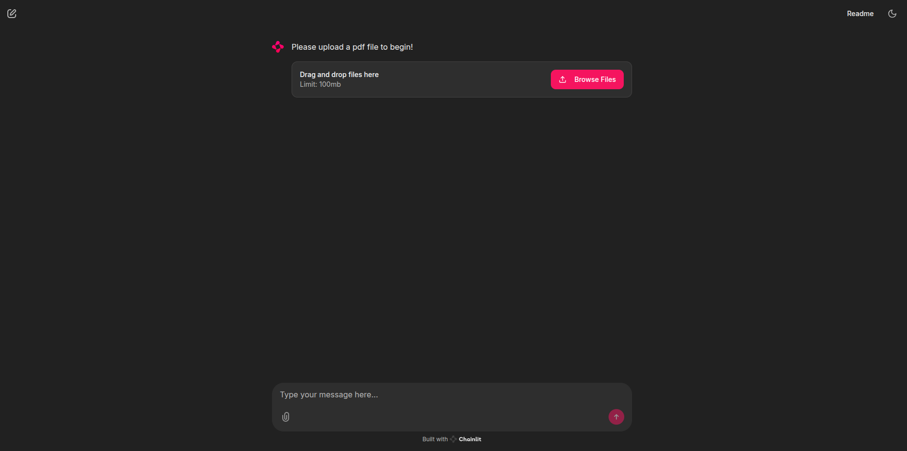

# PDF-Chat: Groq-Powered Document Chatbot

PDF-Chat is an AI-powered document assistant that allows you to have natural conversations with your PDF documents using Groq's powerful LLMs and advanced embeddings. Built with LangChain and Chainlit, this application extracts, processes, and indexes PDF content to provide interactive, context-aware responses to your queries.



## Features

- 📄 **PDF Processing**: Upload and process any PDF document
- 🔍 **Semantic Search**: Find relevant information across your documents
- 💬 **Conversational AI**: Chat naturally with your documents
- 🧠 **Context Awareness**: The system remembers previous questions for more coherent conversations
- 📊 **Source References**: Responses include references to the source content
- 🚀 **High Performance**: Powered by Groq's high-speed inference
- 🔄 **Customizable Models**: Easily swap LLMs and embedding models

## Quick Start

### Prerequisites

- Python 3.8+ installed
- A Groq API key ([Get one here](https://console.groq.com))

### Option 1: Running Natively

1. **Clone the repository**

```bash
git clone https://github.com/toupdate
cd pdf-chat
```

2. **Create a virtual environment**

```bash
python -m venv venv
source venv/bin/activate  # On Windows: venv\Scripts\activate
```

3. **Install dependencies**

```bash
pip install -r requirements.txt
```

4. **Set up environment variables**

Create a `.env` file in the project root:

```
GROQ_API_KEY=your_groq_api_key_here
```

5. **Run the application**

```bash
chainlit run app.py
```

6. **Open in browser**

Navigate to http://localhost:8000 in your browser

### Option 2: Running with Docker Compose

1. **Clone the repository**

```bash
git clone https://github.com/yourusername/pdf-chat.git
cd pdf-chat
```

2. **Create a .env file**

Create a `.env` file with your Groq API key:

```
GROQ_API_KEY=your_groq_api_key_here
```

3. **Build and run with Docker Compose**

```bash
docker compose up
```

4. **Open in browser**

Navigate to http://localhost:8000 in your browser

## Customization

### Changing the LLM Model

PDF-Chat uses Groq's `mixtral-8x7b-32768` by default. To change the model, modify the following line in `app.py`:

```python
llm_groq = ChatGroq(
    groq_api_key=groq_api_key, 
    model_name="mixtral-8x7b-32768",  # Change to any Groq supported model
    temperature=0.2
)
```

Available Groq models include:
- `llama3-8b-8192`
- `llama3-70b-8192`
- `mixtral-8x7b-32768`
- `gemma-7b-it`

### Changing the Embeddings Model

PDF-Chat uses HuggingFace's `sentence-transformers/all-mpnet-base-v2` for embeddings. To change this:

```python
# Initialize with a different sentence-transformer model
embeddings = HuggingFaceEmbeddings(
    model_name="sentence-transformers/all-MiniLM-L6-v2"  # Faster, smaller model
)
```

Other recommended models:
- `sentence-transformers/multi-qa-mpnet-base-dot-v1` (optimized for retrieval)
- `sentence-transformers/paraphrase-multilingual-mpnet-base-v2` (multilingual support)

## Technologies

- [LangChain](https://github.com/langchain-ai/langchain): Framework for developing applications powered by language models
- [Chainlit](https://github.com/Chainlit/chainlit): Building conversational AI interfaces
- [Groq](https://groq.com): Ultra-fast LLM inference
- [HuggingFace Transformers](https://huggingface.co/docs/transformers/index): State-of-the-art NLP models
- [ChromaDB](https://github.com/chroma-core/chroma): Vector database for similarity search
- [PyPDF2](https://github.com/py-pdf/pypdf): PDF document processing

## License

Feel free to use this project as you wish, a credit in the form of a link back to this repo would be greatly appreciated